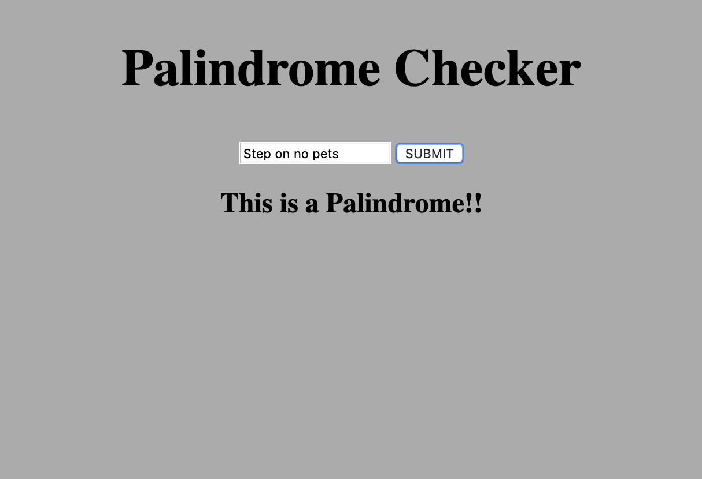

# ↔️ Project: Server Side Palindrome Checker

### I created a simple web application that uses the fs and http modules to validate if a string is a palindrome server side.  The user simply inputs any name to see if its a palindrome.

Tech Used:
- HTML5
- CSS
- Javascript
- NODE.js

To Run on Your Machine:
- Fork Repo
- Clone Repo to your Machine
- NPM instal figlet  
- Run NODE server.js
- Navigate to localhost:8000
