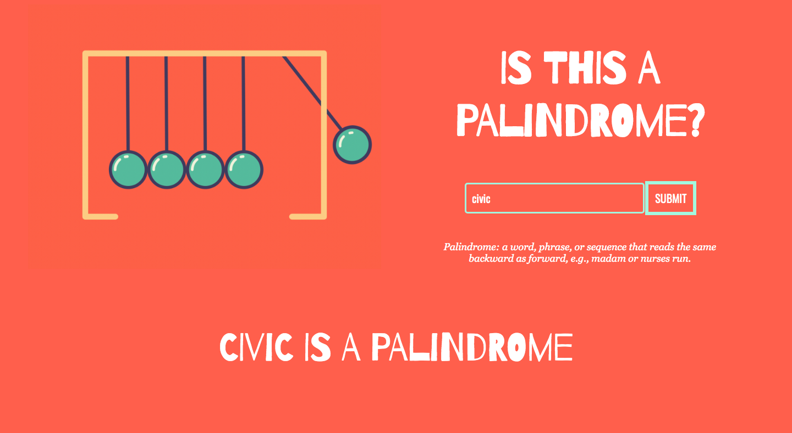

# Server Side Palindrome Checker

### Goal: Create a simple web application that uses the fs and http modules to validate if a string is a palindrome server side.

## Design and Development:
**Tech Used** HTML, CSS, JavaScript, Node, API:
Using JS to only fetch API, strings are passed through and validated in server whether a string is a palindrome.

## Reflections:
First time creating an API and performing functions in Node so it took some time to see how client and server side code were connected. It was valuable to learn how to validate strings in server side for future projects where I may not want clients to be able to see answers or algorithms.
