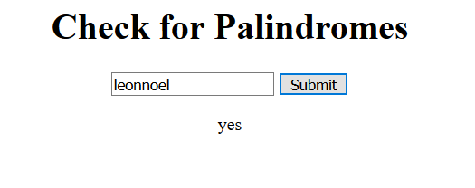

# ↔️ Week08 Bootcamp2019a Project: Server Side Palindrome Checker

### Goal: Create a simple web application that uses the fs and http modules to validate if a string is a palindrome server side.

### How I did it

- Set up server that will send html, css, and js upon request
- Made a text input field and a button that carried an event listener
- Upon being clicked, the event listener would take the value of the input and use that as a search query in a fetch request to the server
- The server would perform a palindrome check and send back a yes or no response to the word given being a palindrome
- The response is then appended to the page for the user to see
