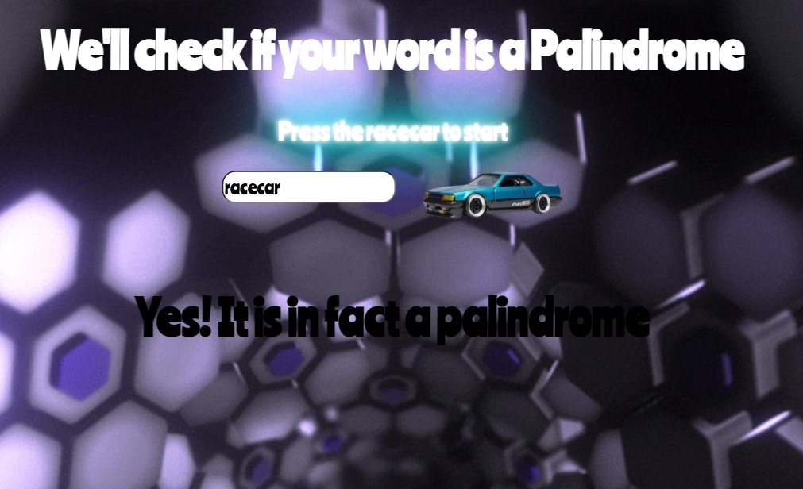

#  Project: Palindrome

### Goal: Create a palindrome checker

This Palindrome checker will check whatever string you put in and check if it is a palindrome. If the word the spelled the same way backwards then it is a paldindrome and the user will be prompted a confirnmation that it is a palidrome. All of this is function through the server side using node.js and referencing the server.js in my main.js to fetch that data to prompt the user. 

# What I used:
-HTML
-CSS
-JAVASCRIPT
-NODE.JS

 
