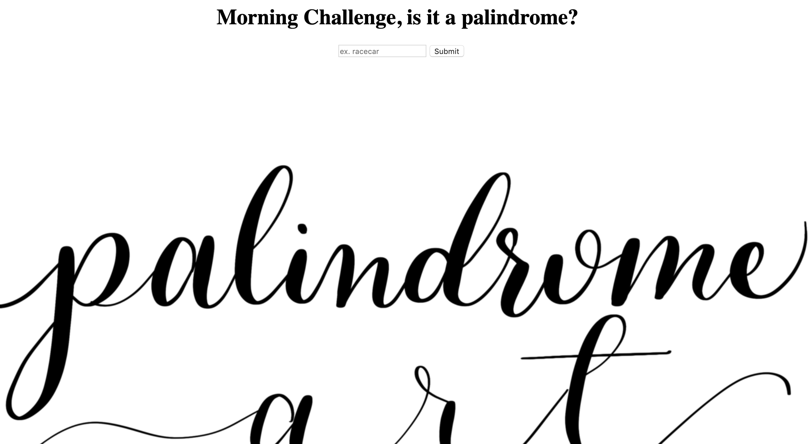

# ↔️ Week 08 Project: Server Side Palindrome Checker

Live Code: 

# How It's Made:
### Tech used: 
HTML, CSS, JS, and Node JS. Create a simple web application that uses the fs and http modules to validate if a string is a palindrome server side.

# Lessons Learned:
The logic of this one was more straight forward and it allowed me to see more of the connection between client side and server side. 

# Examples:

Take a look at these couple examples that I have in my own portfolio:

Wu-Tang Generator: https://github.com/Kim-Flores/wu-tang-generator-bootcamp/tree/answer

Matching Game: https://github.com/Kim-Flores/matching-card-bootcamp/tree/answer

Coin Flip: https://github.com/Kim-Flores/node-coin-flip-bootcamp/tree/answer
