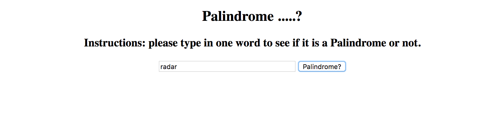

# 📊 Project: Server Side Palindrome Checker

### Goal: Create a simple web application that uses the fs and http modules to validate if a string is a palindrome server side.

* **Project Title: Palindrome**
  - "Palindrome" is a webpage that allows you to type in words to see if they are a palindrome or not.

* **Image of project**

* **Getting Started**
  - Fork this repo
  - type "npm start" in your terminal to begin using it :)
