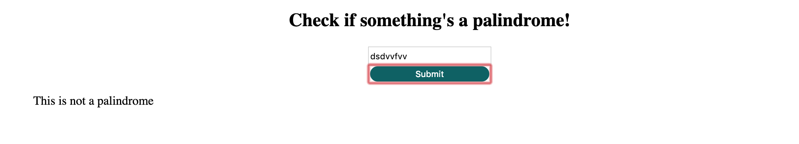

# My Name Generator Project
Goal: Create a simple web application that uses the fs and http modules to validate if a string is a palindrome server side.

## How It's Made:

**Tech used:** HTML, CSS, JavaScript, Framework of choice

## Lessons Learned:

For this project I created a palindrome checker to see if certain words are a palindrome.

